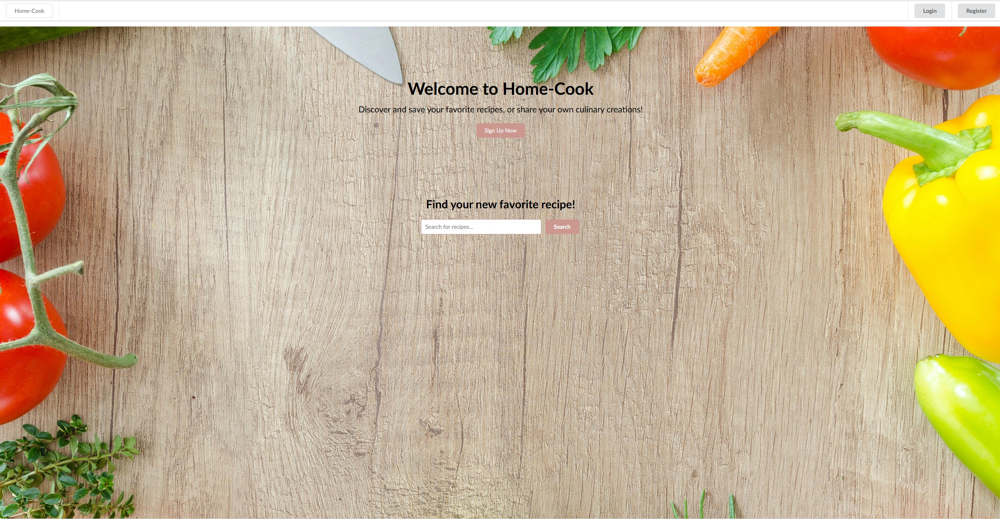
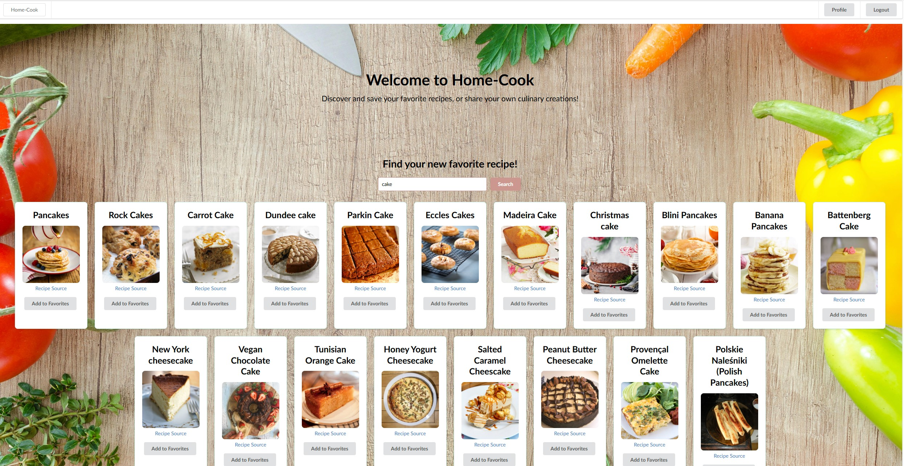
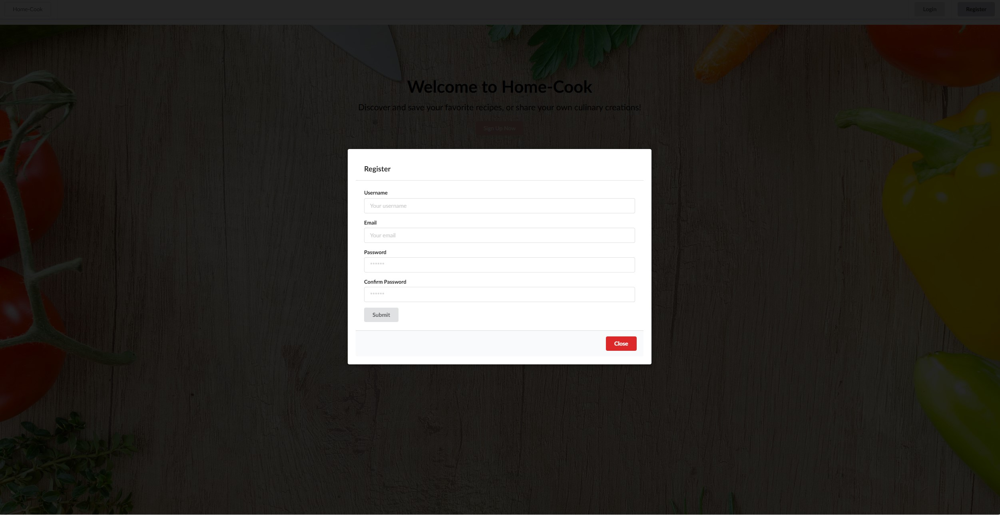
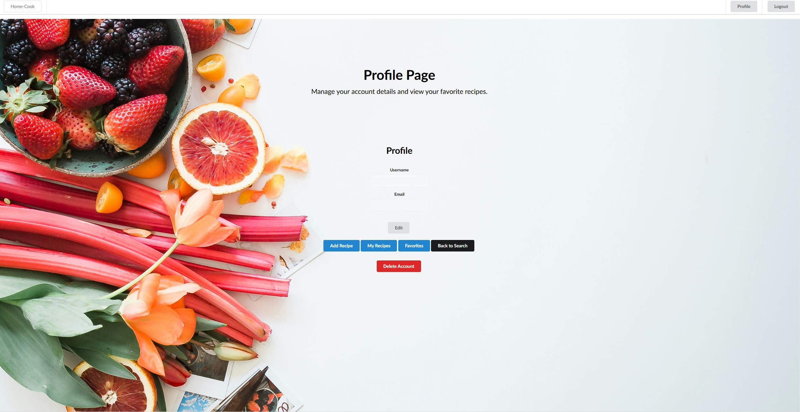
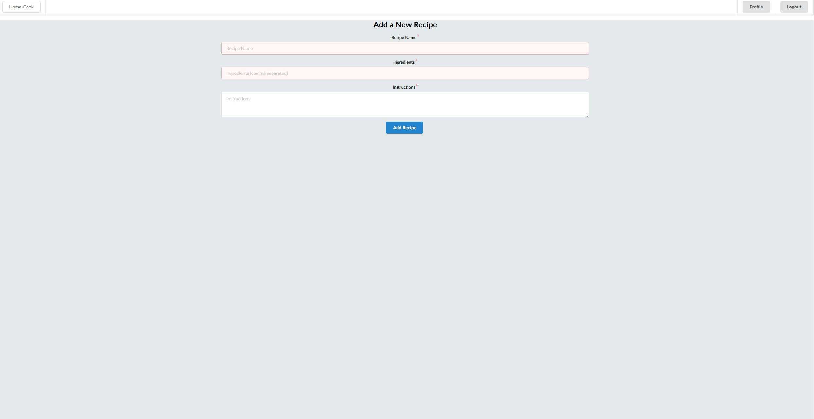
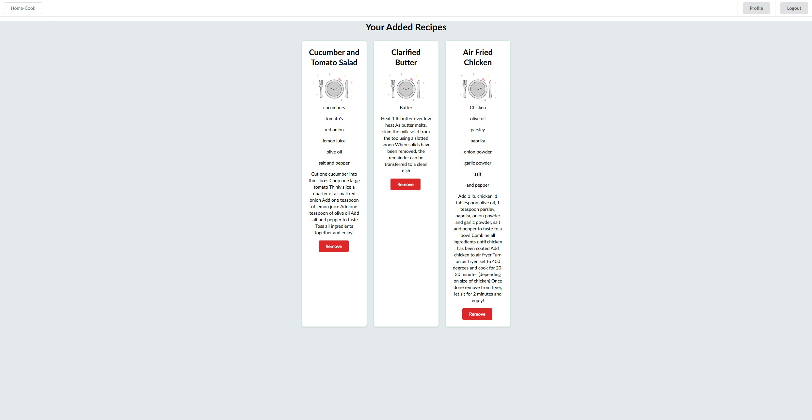
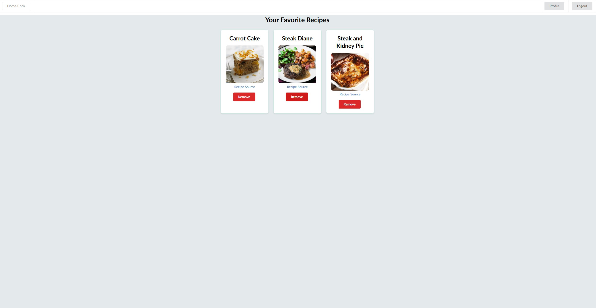

# Home-Cook

 ## Description

Home-Cook is a community-driven platform where users can find new recipes, save their favorite recipes, and add their own recipes to the database. This application aims to provide a seamless and engaging experience for food enthusiasts to discover and share culinary delights.

## Table of Contents

- [Description](#description)
- [Installation](#installation)
- [Features](#features)
- [Technologies](#technologies)
- [Usage](#usage)
- [Screenshots](#screenshots)
- [Deployment](#deployment)
- [Contributing](#contributing)
- [Questions](#questions)


 ## Installation: 

 1. Open the Repo
 * [Home-Cook Repository](https://github.com/Sei-cloud/Home-Cook--Final-Project)

 2. Clone the repository:
    ```bash
    git clone https://github.com/Sei-cloud/Home-Cook--Final-Project
    ```

 3. Navigate to the project directory:
    ```bash
    cd Home-Cook--Final-Project 
    ```

4. Install the dependencies for both the client and server:
    ```bash
    npm run install
    ```

5. Create a `.env` file in the `server` directory
*Add and fill out the MONGODB_URI, JWT_SECRET and PORT

6. Start the development server:
    ```bash
    npm run develop
    ```
## Features

- User Authentication with JWT
- Recipe Management (add, update, delete recipes)
- Search and Filter (search by ingredients, cuisine, dietary preferences)
- Save Favorites and add own Recipes 
- Deployment on Render with MongoDB Atlas

## Technologies

- **Front-end:**
  - React
  - Semantic UI React
  - Apollo Client
  - GraphQL

- **Back-end:**
  - Node.js
  - Express.js
  - MongoDB
  - Mongoose
  - Apollo Server
 ## Usage

1. Open your browser and navigate to `http://localhost:3000`.
2. Sign up for a new account or log in with an existing account.
3. Search for recipes, save your favorites, and add your own recipes.

## Screenshots

### Home Page


### Recipe Search Results


### User Registration/Login


### User Profile Page


### Add Recipe Page


### My Recipes Page


### Favorites Page


## Deployment

The application is deployed on Render.

- **Live Application:** [Home-Cook Deployed](https://home-cook-final-project.onrender.com/)

- **GitHub Repository:** [Home-Cook GitHub](https://github.com/Sei-cloud/Home-Cook--Final-Project)

## Contributing

Contributions are welcome! Please follow these steps:

1. Fork the repository.
2. Create a new branch (`git checkout -b feature/your-feature`).
3. Commit your changes (`git commit -m 'Add your feature'`).
4. Push to the branch (`git push origin feature/your-feature`).
5. Open a pull request.

 ## Questions
 
 For any questions about this project, contact our team!

  ### Github: 
  * [Charlie Boyle](https://github.com/charliejb1)
  * [Sam Cowman](https://github.com/Sam-Cowman)
  * [Sei](https://github.com/Sei-cloud)
  
  
